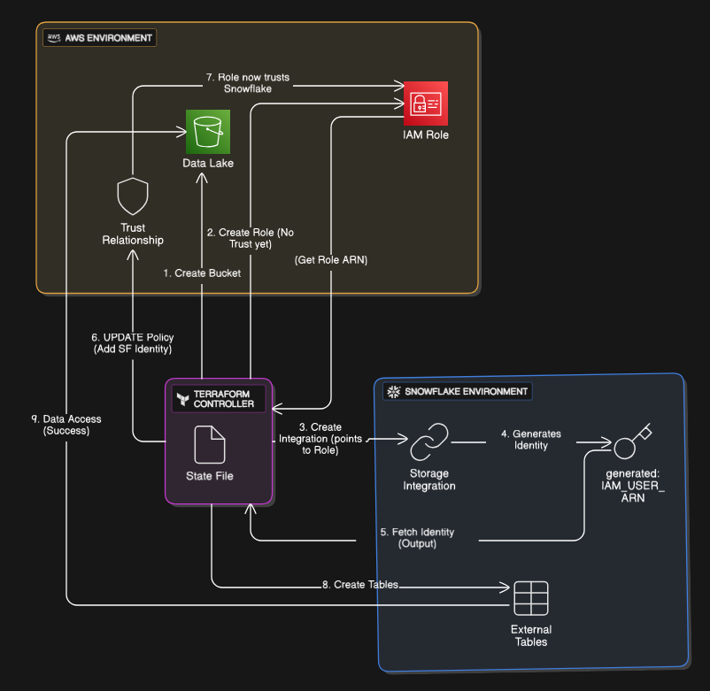

# ☁️ Infrastructure & Security

The infrastructure is fully defined as code using **Terraform**. It manages resources in **AWS** (Compute/Storage) and **Snowflake** (Warehouse).

## Resource Map

| Component | AWS Resource | Local Equivalent |
| :--- | :--- | :--- |
| **Storage** | `aws_s3_bucket` | MinIO Container |
| **Compute** | `aws_ecs_cluster` (Fargate) | Docker Engine |
| **Identity** | `aws_iam_role` | N/A (MinIO Keys) |
| **Container Registry** | `aws_ecr_repository` | Local Image Cache |
| **Orchestrator** | `aws_sfn_state_machine` | Dagster Daemon |

## The Security Handshake (AWS <-> Snowflake)

One of the most complex parts of the infrastructure is establishing a secure, password-less connection between Snowflake and AWS S3. This requires a circular dependency resolution handled by `scripts/deploy_infra.sh`.

## Docker Implementation

The project uses a **Multi-Image Strategy**:
1.  **Ingestion Image:** Lightweight `python:3.12-slim` image containing only extraction logic.
2.  **Analytics Image:** Heavier image containing `dbt-core`, `git`, and adapter dependencies.

This separation ensures that ingestion tasks start up quickly (low cold-start time on AWS Fargate) while the analytics task has all the heavy dependencies needed for transformation.