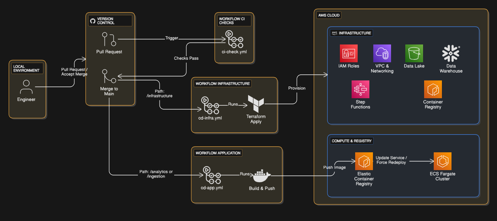

# Football_Data_Engineering_pipeline ⚽️🏟️🏃‍♂️


A robust, environment-agnostic ELT pipeline designed to ingest **Global Football Market Data** (leagues, matches, and player stats), process it using a modern data stack, and serve analytical models for performance scouting and market trends.

The system runs in two modes with complete feature parity:
*   **🏠 Local Mode:** Docker, MinIO (S3), DuckDB, Dagster.
*   **☁️ Cloud Mode:** AWS ECS (Fargate), S3, Snowflake, Step Functions.

---

## 🏗️ Architecture
The system uses a **Hybrid Architecture** to optimize for both Developer Experience (Local) and Cost-Effective Scaling (Cloud).

### 🗺️ System Flow


*   **Idempotent Ingestion:** "Smart Resume" logic checks storage before fetching, preventing API rate-limit exhaustion from football data providers.
*   **Hybrid Design:** Switch between a local lightweight stack and a heavy-duty enterprise cloud stack with a single config change.

---

## 🔄 CI/CD & DevOps
We utilize **GitHub Actions** for a fully automated DevSecOps workflow. 🛡️

### 🗺️ CI/CD Workflow


*   **🔐 Security:** Keyless authentication via **AWS OIDC** (No long-lived access keys in GitHub).
*   **🤖 Automation:** Decoupled pipelines for Quality Assurance, Infrastructure (IaC), and Application Code.
*   **🧪 Quality:** Automated linting and unit testing for Python and dbt transformations.

---

## 🚀 Key Features

*   **⚽ Football Data Intelligence:** Optimized for high-frequency match updates and historical league data.
*   **🛠️ Infrastructure as Code:** Complete AWS & Snowflake environment provisioning via **Terraform** with Remote S3 State Locking.
*   **🎯 Zero-Drift Config:** A single `config/endpoints.json` acts as the Source of Truth for both Python ingestion and Terraform resources.
*   **📦 Secure Automation:** Deployment uses OIDC Identity Providers, ensuring least-privilege access without sharing static credentials.
*   **💎 Optimized Warehousing:** Snowflake External Tables use **Partition Pruning** to minimize S3 scanning costs.

---

## 🛠️ Tech Stack

| Layer | 🏠 Local (Dev) | ☁️ Cloud (Prod) |
| :--- | :--- | :--- |
| **Ingestion** | 🐍 Python 3.12 (Tenacity) | 🐍 Python 3.12 (AWS Fargate) |
| **Orchestration** | 🛰️ Dagster | ⛓️ AWS Step Functions |
| **Storage** | 📦 MinIO (S3 API) | 🪣 AWS S3 |
| **Warehouse** | 🦆 DuckDB | ❄️ Snowflake |
| **Transformation** | 📊 dbt (Data Build Tool) | 📊 dbt (Data Build Tool) |
| **Infrastructure** | 🐋 Docker | 🏗️ Terraform |
| **CI/CD** | 🛠️ Make | 🐙 GitHub Actions |

---

## 📚 Documentation

| Guide | Description |
| :--- | :--- |
| 🏗️ [**Architecture**](./docs/architecture.md) | Deep dive into Idempotent Ingestion, Hybrid Design, and Orchestration. |
| 🔐 [**CI/CD & Security**](./docs/cicd.md) | How GitHub Actions, OIDC, and Release strategies work. |
| ⚙️ [**Infrastructure**](./docs/infrastructure.md) | AWS Resource map, S3 Backend State, and Partitioning logic. |
| 📉 [**DWH Design**](./docs/dwh.md) | Incremental Merge strategy (Natural Keys), Partitioning, and Data Quality. |
| 💻 [**Local Setup**](./docs/setup.md) | How to run the pipeline locally with Docker. |

---

## ⚡ Quick Start

### A. 🏠 Local Development (Docker)
1. **Configure Environment:**
   ```bash
   cp .env.example .env
   # Add your Football API Key (e.g., API-Football )

2. **Start Services:**
```Bash
make local-start 
```
3. **Access UI:**
- Dagster: http://localhost:3000
- MinIO: http://localhost:9001

### B. ☁️ Production Deployment (CI/CD)

Manual deployment is only required for the initial bootstrap. Once OIDC is established, GitHub Actions handles the rest.

1. Fork Repository.
2. Configure Secrets: Add AWS Account ID, API Keys, and Snowflake Credentials to GitHub Secrets. (see [CI/CD Guide](./docs/cicd.md))
3. Bootstrap OIDC:
```Bash
export TF_VAR_github_repo="your-username/your-repo"
make prod-infra-apply
```
4. Push: Any commit to main will automatically deploy Infrastructure and Code updates. 🚀
